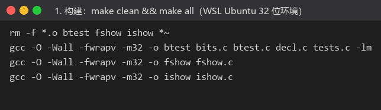
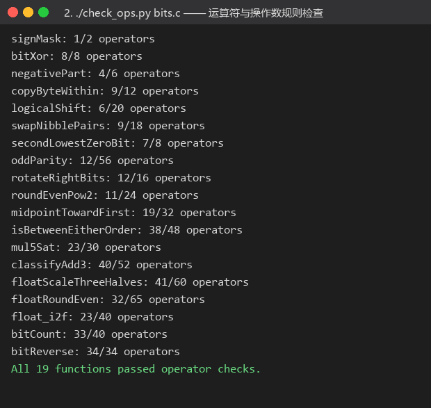
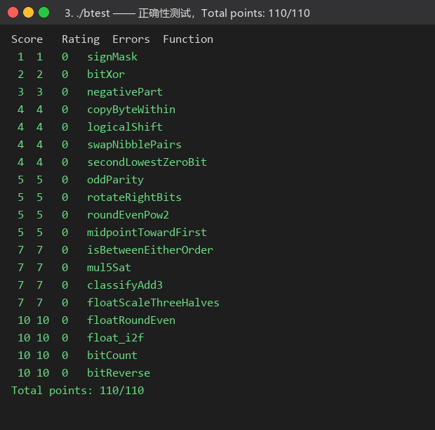

# Lab1：DataLab 实验报告

| 项目 | 内容 |
| --- | --- |
| 姓名 / GitHub | Mount-B |
| 学号 | 25300680098 |
| 个人仓库 | `https://github.com/Mount-B/DataLab` |
| 实验日期 | 2026 年 10 月 9 日 |
| 实验环境 | Windows 11 + WSL2 Ubuntu 26.04.1 LTS，gcc 15.2.0（`-m32 -fwrapv`，gcc-multilib + libc6-dev-i386），`btest`/`dlc` 均为仓库自带 |

## 一、完成情况

- `make clean && make all`：编译通过，无警告；
- `./check_ops.py bits.c`：**All 19 functions passed operator checks.**（19 题的操作数均在限制内）
- `./btest`：**Total points: 110/110**（19 题 Errors 全为 0）

*图 1：在 WSL（32 位 Linux ELF 环境）中构建 `btest`/`ishow`/`fshow`。*

*图 2：`./check_ops.py bits.c` 的输出——每题的「当前操作数/最大操作数」，最后一行显示 19 题全部通过。*

*图 3：`./btest` 的输出——19 题 Errors 均为 0，总分 110/110。*

除仓库自带的 `check_ops.py` 与 `btest` 外，我还另外写了一个差分测试程序：用更宽的类型（`long long`）和真实的浮点运算（`(double)f*1.5` 再舍入到 `float`、`nearbyintf`）写出参考实现，对每道题做边界值 + 30 万组随机整数的逐位比对，以及对 40 万组随机浮点位模式的比对，全部通过。这一步帮我抓到了下面第三节里提到的三个错误。

## 二、逐题实现思路

> 下列「操作数」为 `check_ops.py` 报告的「实际/上限」。

### P1 `signMask` —— 1/2
最高位掩码就是 `1 << 31`（数据实验的位向量模型允许左移进入符号位）。

### P2 `bitXor` —— 8/8
只允许 `~` 和 `&`。先把异或写成 `x^y = (x|y) & ~(x&y)`，再用德摩根律把 `|` 换成 `~` 与 `&`：
`x^y = ~( ~(x & ~y) & ~(~x & y) )`。正好 8 个操作数，卡在上限。

### P3 `negativePart` —— 4/6
`x >> 31` 得到符号掩码（负数全 1、非负全 0），而 `-x` 用 `~x + 1` 构造，两者相与即可：非负时被清零，负数时得到 `-x`。

### P4 `copyByteWithin` —— 9/12
把 `x` 右移 `src*8` 位后 `& 0xFF` 取出源字节；用 `~(0xFF << dst*8)` 清空目标字节对应的 8 位；再把取出的字节左移 `dst*8` 位或进去。注意 `src/dst` 为 3 时移位到最高字节是合法且期望的行为（位向量模型）。

### P5 `logicalShift` —— 6/20
算术右移会把符号位复制到高 `n` 位，因此需要一个掩码把高 `n` 位抹掉：`~(((1 << 31) >> n) << 1)`。当 `n = 0` 时该掩码为全 1，`n` 逐渐变大时高位的 1 逐个消失，正好保留低 `32-n` 位。

### P6 `swapNibblePairs` —— 9/18
常量只能用 0–255，所以先构造掩码 `m = 0x0F | (0x0F<<8)`，再 `m |= m << 16` 得到 `0x0F0F0F0F`。然后 `((x & m) << 4) | ((x >> 4) & m)`：低半字节搬到高半字节、高半字节搬到低半字节。

### P7 `secondLowestZeroBit` —— 7/8
求最低 0 位的经典写法是 `~x & (x + 1)`：加 1 会把最低的连续 1 串清零并把最低的 0 位变成 1，于是这个表达式正好只留下最低 0 位。把它补成 1（`x | low`）后再做一次同样的运算，得到的就是**次低**的 0 位；若不存在第二个 0 位（如 `-1`、`0x7FFFFFFF`）结果自然为 0。

### P8 `oddParity` —— 12/56
把 32 位逐步折半异或（16、8、4、2、1），最低位就变成全部位的异或，即 1 的个数的奇偶性；题目要的是「偶数个 1 返回 1」，所以最后返回 `~e & 1`。

### P9 `rotateRightBits` —— 12/16
先 `n & 31` 取模（`n` 可能很大）。循环右移 = 右移 `m` 位 | 左移 `32-m` 位，但**算术右移会带进符号位**，所以右移部分要再与掩码 `~(((1<<31) >> m) << 1)`，把高 `m` 位的符号扩展去掉（这里正是我第一版写错、被差分测试抓出来的地方）。

### P10 `roundEvenPow2` —— 11/24
设 `q = x >> n`（商）、`half = 2^(n-1)`。若余数 `< half` 应舍、`> half` 应入、`= half` 时应按「商的奇偶」决定。统一写法：把 `x + (half - 1) + (q & 1)` 再右移左移 `n` 位——余数小于半程时不足以进位，大于半程时一定进位，恰好半程时由 `q` 的最低位决定（奇数进位成偶数、偶数不进位），即「四舍六入五成双」。

### P11 `midpointTowardFirst` —— 19/32
`(x + y) / 2` 会溢出，所以用 `(x & y) + ((x ^ y) >> 1)` 精确计算 `floor((x+y)/2)`（该式等价于按位进位，不会溢出）。当 `x+y` 为奇数时结果落在两个整数中间，需要判断 `x > y` 来决定是否 +1；直接算 `x - y` 也可能溢出，因此用「两操作数符号不同 且 差的符号与 `x` 不同」修正符号位的经典方法得到真实的大小关系。

### P12 `isBetweenEitherOrder` —— 38/48
先用上面带溢出修正的符号比较求出 `lo = min(a,b)`、`hi = max(a,b)`（用掩码在 `a`、`b` 之间选择），再判断 `x` 是否落在 `[lo, hi]`：即 `!(x < lo) && !(hi < x)`，两次比较同样都用溢出修正的符号法。

### P13 `mul5Sat` —— 23/30
`x*5 = (x<<2) + x`，分两步检查溢出：
1. 左移 2 位是否丢位：`(t >> 2) ^ x` 非 0 说明 `x*4` 溢出（`t = x<<2`）；
2. 加法是否溢出：`(t ^ r) & (x ^ r)` 的符号位为 1 说明同号相加得到异号。
任一步溢出就饱和：用 `x >> 31` 取符号，`~(1<<31) + (x<0)` 得到 `INT_MAX` 或 `INT_MIN`，再用掩码在饱和值与真实回绕值之间选择。这也解释了为什么不能用「结果符号」判溢出——`0x40000000 * 5` 回绕后仍是正数。

### P14 `classifyAdd3` —— 40/52
把精确和写成「32 位回绕值 + 进位个数 × 2³²」。分两次做加法（先 `x+y` 再 `+z`），每次用 `(a ^ r) & (b ^ r)` 判断是否溢出、用被加数的符号判断进位方向（+1 或 -1）。总进位为 0 时精确和就是回绕值，落在 `int` 范围内返回 0；总进位为正说明超过 `INT_MAX` 返回 1；为负说明小于 `INT_MIN` 返回 -1。这样不需要更宽的类型，也能处理 `INT_MAX + INT_MAX + INT_MIN` 这类「中间溢出但最终不溢出」的情况。

### P15 `floatScaleThreeHalves` —— 41/60
把 `|f|` 统一写成 `M × 2^(E-150)`：规格化数 `M = 尾数 | 0x800000`、`E = 阶码`；非规格化数 `M = 尾数`、`E = 1`。乘 3/2 后即 `P × 2^(E-151)`，其中 `P = 3M = M + (M<<1)`（`P < 2²⁶`，不会溢出）。
- `P < 2²⁴`：结果是非规格化数，把 `P` 除以 2 并做就近舍偶；
- 否则按 `P ≥ 2²⁵` 决定除数 2 或 4（对应阶码 +0/+1），余数与半值比较做就近舍偶，若舍入进位到 `2²⁴` 则尾数回到 `2²³`、阶码 +1；
- 阶码升到 255 时返回无穷；`NaN`/`Inf`/`±0` 原样返回（因此 `-0` 的符号被保留）。

### P16 `floatRoundEven` —— 32/65
分离符号、阶码、尾数：
- `NaN`/`Inf` 原样返回；
- 非规格化数（含 0）绝对值小于 0.5，一律返回 ±0（保留符号位）；
- 阶码 `≥ 150` 时该浮点值本身就是整数，直接返回；
- 否则补上隐含的 1 得到整数 `M`，右移 `shift = 150 - e` 位；`shift ≥ 25` 说明值小于 0.5，返回 ±0；否则对移出的 `shift` 位做就近舍偶得到整数 `Q`；
- `Q = 0` 说明舍入到零，返回 ±0（保留符号）；`Q` 恰好是 `2²⁴` 时归一为 `2²³`；
- 最后把 `Q`（≤ 2²⁴）规格化成浮点数：循环左移直到第 23 位置 1，同步递减阶码，再拼成符号 | 阶码 | 尾数。

### P17 `float_i2f` —— 23/40
`x = 0` 直接返回 0；负数用 `~x+1` 得到幅值（这样 `INT_MIN` 也能正确取到 `2³¹`）并置符号位。把幅值左移直到最高位为 1，记录移动次数 `t`，阶码即 `127 + 31 - t = 158 - t`；此时低 8 位就是被舍去的部分，与 `0x80` 比较做就近舍偶（等于 `0x80` 时看尾数最低位）。若尾数进位到 `2²⁴` 则尾数取 `2²³`、阶码 +1。

### P18 `bitCount` —— 33/40
分治统计：用 `0x55555555`、`0x33333333`、`0x0F0F0F0F`、`0x00FF00FF`、`0x0000FFFF` 五个掩码，把相邻 1、2、4、8、16 位的计数逐层相加。**每一步都必须把中间结果限制回各自的字段**（我第一版在 8 位那步漏了掩码，`bitCount(0x80000000)` 会得到 257 而不是 1）；掩码本身由 `0x55`、`0x33`、`0x0F`、`0xFF` 通过「先拼出 16 位、再 `| (m<<16)`」的方式构造，以省下操作数。

### P19 `bitReverse` —— 34/34
5 层「分组交换」：相邻位（掩码 `0x55555555`）→ 相邻 2 位（`0x33333333`）→ 半字节（`0x0F0F0F0F`）→ 字节（`0x00FF00FF`）→ 16 位半字（无需掩码，但右移同样要防符号扩展）。
为了压进 34 个操作数，四个掩码不是各自从头拼，而是从 `0x00FF00FF` 逐级用异或推出：`0x0F0F0F0F = 0x00FF00FF ^ (0x00FF00FF << 4)`、`0x33333333 = 0x0F0F0F0F ^ (0x0F0F0F0F << 2)`、`0x55555555 = 0x33333333 ^ (0x33333333 << 1)`、`0x0000FFFF = (0x00FF00FF >> 8) | 0xFF`，共省下 4 个操作数。最后一步 `(x << 16) | ((x >> 16) & m16)` 中掩码是必需的——直接用 `(x >> 16) | (x << 16)` 在 `x < 0` 时会因为算术右移把高 16 位填成符号位而出错（`bitReverse(0x7FFFFFFE)` 会得到 `0xFFFFFFFE`），这也是差分测试帮我抓到的第三个错误。

## 三、实验中的调试过程（简要记录）

1. 先把 19 题一次性写完，`check_ops.py` 一次通过（说明运算符与操作数写法都合法），但 `btest` 只有 85/110：`rotateRightBits` 在 `n = INT_MAX`、`x = INT_MIN` 时给出 `-1`（应为 `1`），`bitCount(0x80000000)` 给出 257（应为 1），`bitReverse(0x7FFFFFFE)` 给出 `0xFFFFFFFE`（应为 `0x7FFFFFFE`）。
2. 三个错误的原因都与「算术右移带进符号位」或「中间结果没有及时用掩码限制」有关：前两处补上掩码、`bitCount` 在 8 位那步补上 `0x00FF00FF`，`bitReverse` 的最后一步改成带掩码的写法后，`btest` 达到 110/110。
3. 为了确认不是「刚好过了测试向量」，我又写了差分测试程序，用更宽的类型 / 真实浮点运算做参考，对边界值和大量随机输入逐位比对，全部一致。

## 四、参考与引用

- CS:APP 教材（*Computer Systems: A Programmer's Perspective*, 3rd ed.）第 2 章「信息的表示和处理」：补码、移位、溢出检测与 IEEE 754 单精度格式；
- 仓库自带的 `README.md`、`bits.c` 中的逐题注释，以及 `decl.c`/`tests.c` 中的参数范围与参考行为；
- Hacker's Delight 中关于位计数、位反转与「掩码 + 移位并行」的经典位技巧（如 `~x & (x+1)` 求最低 0 位、分治 popcount）；
- 掩码构造的化简（`0x0F0F... ^ (<<4)` 得到 `0x3333...` 等）由我自己推导并用差分测试验证。

## 五、感受与建议

**感受：** 这次实验最大的收获不是记住了几个位技巧，而是体会到「**先想清楚位级语义，再用受约束的运算符表达它**」。比如 P13 不能靠「结果符号」判溢出，P11/P12 的比较必须做溢出修正，P15/P16 要分清规格化与非规格化、以及「就近舍偶」在边界上的行为——这些点只要概念上含糊，代码就一定会错。另外，`check_ops.py` 只管写法合法、`btest` 只测有限向量，两者都通过并不等于真的正确，自己写差分测试的价值比我预想的大得多。

**建议：**
1. 建议在文档里提示 `btest` 的测试向量是固定的，鼓励同学用「更宽类型/真实浮点」写参考实现对拍，这比反复跑 `btest` 更能发现边界问题；
2. 可以提示常见坑：「算术右移会带进符号位」「8 位那一步也要掩码」「`btest` 不会自动重新编译，改完 bits.c 必须 `make clean && make all`」（这一条文档已有，但如果能放在每个「测试」小节的开头会更醒目）；
3. 若能在仓库里提供一个本地 `verify` 模板（差分测试骨架），既不影响评分，又能明显减少「本地通过、线上翻车」的情况；
4. `check_ops.py` 的输出建议把「接近上限」的题（例如 `bitReverse: 34/34`）标一下颜色或加个提示，方便同学知道哪些实现还有优化空间。
